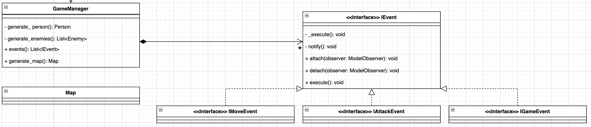
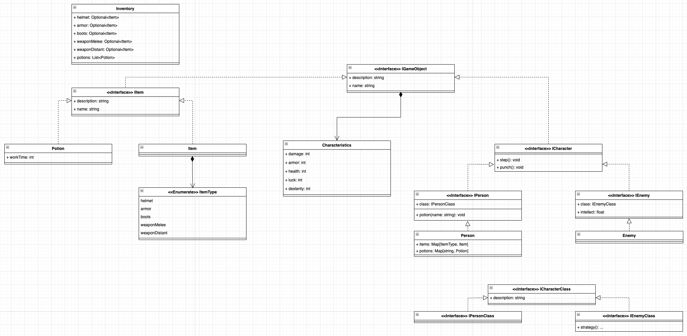

[..](../README.md)

# Описание компонентов

## Model

`GameManager` - компонент для генерации карты `Map` и персонажей. Так же имеет в себе все возможные события для карты и игры.

`IEvent` - интерфейс для возможных событий. `attach/detach` - методы для добавление/удаления "наблюдателя". `execute` - метод ("стратегия"), перегружаемый каждым инстансом (`notify` и `_execute` исполняются сами изнутри). 

`IMoveEvent`, `IAttackEvent`, `IGameEvent` - более конкретные интерфейсы для событий. 

## Model.GameObject

`IGameObject` - интерфейс для всех объектов в игре. 

`IItem` - интерфейс для всех доступных вещей в игре. Вещь может быть `Potion` или `Item` (который представляет один из типов снаряжения)

`ICharacter` - интерфейс для всех персонажей в игре. Персонаж может быть `IPerson` или `Enemy`. Оба содержат свой `ICharacterClass` (причём у `IEnemyClass` есть `strategy`, определяющая его поведение). 

`IPersonClass` и `IEnemyClass` имеют несколько реализаций.
