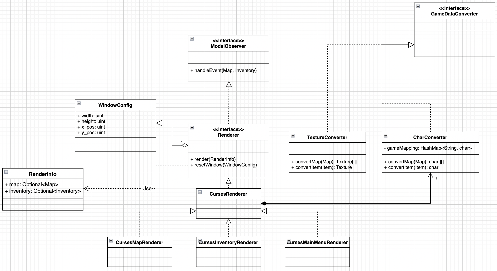

[..](../README.md)

# Описание компонентов

## View

`ModelObserver` — интерфейс для реализации паттерна "Наблюдатель". Необходим для работы с `Model` компонентой

`Renderer` — интерфейс описывающий сущность рендерера — объекта который отрисовывает картинку

`CursesRenderer` — промежуточная сущность для рендереров, использующих ncurses в качестве бекэнда

`CursesMapRenderer`, `CursesInventoryRenderer` и `CursesMainMenuRenderer` — рендереры для соответствующих сущностей

`WindowConfig` — структура для задания настроек отрисовки, связанных с окнами

`RenderInfo` — структура для хранения сущностей для отрисовки

`GameDataConverter` — интерфейс, объединяющий конвертеры игровых сущностей в текстуру/символ

`TextureConverter` и `CharConverter` — конвертеры в текстуру или символ
