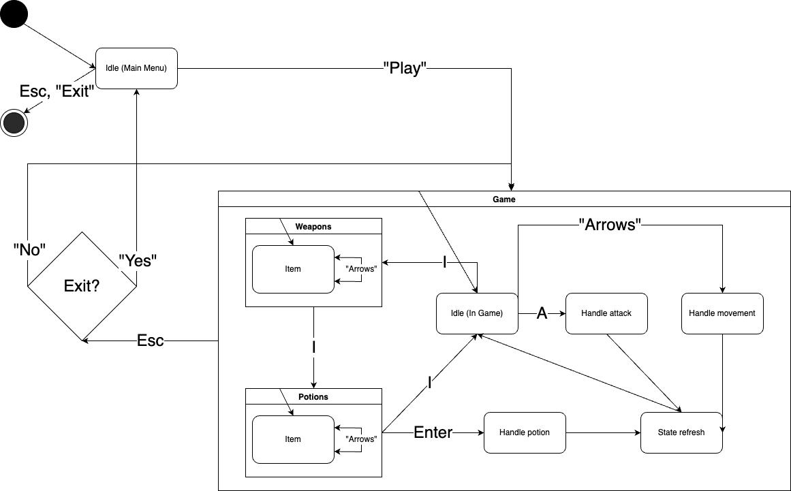

[..](README.md)

# Описание компонентов

`Idle (Main Menu)` - начальный экран из которого можно начать игру и перейти в контейнер `Game` или выйти. 

`Game` - контейнер для взаимодействия пользователя с игрой. 

`Idle (In Game)` - состояние ожидания действий пользователя. 

`Weapons` - контейнер со снаряжением персонажа. `Item` внутри него - это объекты с которыми может взаимодействовать пользователь. 

`Potions` - контейнер с зельями, доступными персонажу. `Item` внутри него - это объекты с которыми может взаимодействовать пользователь. Выбранный (текущий) `Item` можно применить. 

`Handle potion` - состояние обработки использования залья. 

`Handle attack` - состояние обработки атаки. 

`Handle movement` - состояние обработки передвижения. 

`State refresh` - состояние после любого действия пользователя, подготавливает систему к новому шагу. 

`Exit?` - подтверждает выход в главное меню из контейнера `Game`. 
